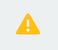
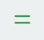

# Three-way matching

Only pay for what you've ordered and received, by automatically matching each invoice to both the corresponding purchase order and goods receipt. This guide explains how to review automatic three-way matching, and manually match if needed.

If you'd like to learn more about what three-way matching is and why your organisation may use it, see [Understanding two-way and three-way matching](understanding-two-way-and-three-way-matching.md).

## Best practices

- Check quantities and prices match between documents when automatically matched
- Check all line items are matched correctly
- Ensure any discrepancies are approved in line with your organisation's policies

## Quantity-based vs amount-based matching

Zudello offers two approaches to matching invoice lines to purchase order and goods receipt lines:

- Quantity-based matching compares specific quantities across documents, ensuring the exact number of units are reflected in purchase orders, goods receipts, and invoices. 
	- For example, when ordering 100 components at $5 each, quantity-based matching verifies you received and are being billed for the correct number of components.

- Amount-based matching compares monetary values across documents, and "draws down" on the approved amount until the purchase order is exhausted.
	- For example, when ordering consulting services for $5,000, amount-based matching ensures the total invoiced amount has been delivered and doesn't exceed the approved purchase order value.

## Automatic matching

When an invoice is uploaded to Zudello, the purchase order number will be extracted where one exists. If a purchase order with that number is found in Zudello, the system automatically matches the two documents. 

If a goods receipt with the same number exists, or a receipt has been matched to the purchase order, the receipt will also be matched.

Each line item on the invoice is automatically matched to the corresponding lines on the purchase order and goods receipt. For quantity-based matching, common for stock invoices, matching is based on one of the following:
- Stock code
- Description
- Quantity and unit price

For amount-based matching, common for service invoices, invoice line items can be matched with the methods above. Alternatively, lines can be matched top-to-bottom to any available purchase order line, until either all lines are matched or the purchase order is exhausted.

Matching results are displayed with the following icons:

| Icon                                                         | Matched status                                                                           |
| ------------------------------------------------------------ | ---------------------------------------------------------------------------------------- |
|  | Fully matched                                                                            |
|                             | Partially matched; the number indicates the missing quantity                             |
|                       | Line not matched                                                                         |
|                                   | The price of the matched transactions matches the price of the current transaction       |
|  | The price of the matched transaction is higher than the price of the current transaction |
|  | The price of the matched transaction is lower than the price of the current transaction  |
|  | Multiple icons appear if you are matching to multiple transactions                       |

### Manual matching

If invoice lines can't be automatically matched to either purchase order or receipt lines, you can manually match them. To do so:

1. Open the invoice
2. Scroll down to the **Items** section
3. Look for icons indicating unmatched items
   

   
4. Click the icon on the line you'd like to match
5. The matching modal will open to the current matched purchase order or receipt
6. To match lines on the current purchase order/receipt, click **Match line**
   
   
7. The line will automatically match with the lesser of the invoice line quantity and the remaining purchase order/receipt line quantity
8. To adjust the matched quantity, use the arrows next to the allocated quantity
   
   
9. To match lines on a different purchase order/receipts, click **View other purchase orders** or **View other receipts**
10. Find the relevant purchase order/receipt by scrolling or searching
 > Purchase orders and receipts will be limited to only those with the same supplier as the current invoice
11. Repeat steps 6-9
12. Click **Close**
13. Review the matching results on the invoice:
   - Green ticks indicate fully matched quantities
   - Green equal signs indicate fully matched prices
   - Yellow icons indicate remaining unmatched items or price variances

## Reviewing and editing matching

To review and edit existing matching, click the expand icon at the start of a line.

This will show the purchase order and receipt matched to the line, and the quantity and price for each. Click the **Document #** to open the related purchase order or receipt.

To edit existing matching, click the edit icon next to **Purchase Order** or **Receipt**. This will open the matching modal, and you can follow the steps for manual matching above. 

## Processing matched documents

Once matching is complete, continue processing the invoice as normal

1. Review all line items for accuracy
2. Ensure all required fields and coding are complete
3. Click **Save and submit**
4. The invoice will move through your organisation's standard document flow
   
> If you're unsure how three-way matching affects your organisation's document or approval flow, please contact your organisation administrator for more information. 

## Need help?

Contact your organisation administrator or Zudello support for assistance with two-way matching.