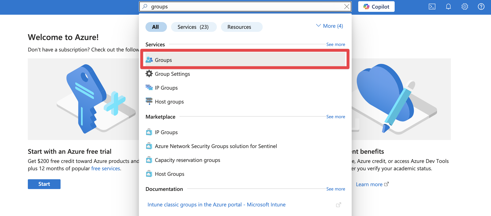

# Microsoft Entra ID (Azure AD) - User provisioning

Enable automatic user provisioning for your Zudello environment with Microsoft Entra ID (formerly Azure AD). This guide explains how to configure the required application settings and manage users through Entra ID.

> Before setting up user provisioning, please ensure you have completed all steps to set up [Microsoft Entra single sign-on](microsoft-entra-azure-ad-sso.md). If you have not completed SSO setup, please do so before proceeding with the steps below.
## Best practices

To ensure smooth and secure user provisioning:

- Create a dedicated Entra group for Zudello users
- Review group membership regularly in both systems
- Document your implementation settings for future reference
- Remove users from the Zudello group rather than deleting their accounts

## Configuring Microsoft Entra ID for user provisioning

### Creating an Entra group

1. Search for and select **Groups**

2. From the sidebar, click **All groups**

3. Click **New group**
4. Under **Group type**, Select **Microsoft 365** 
5. Under **Group name** enter **Zudello**
6. Under ****
7. Under **Description** enter **Access to the Zudello application**

### Completing implementation

Provide the following information to Zudello to complete your implementation:

- Application (Client) ID
- Directory (tenant) ID
- Client Secret value
- Name of the Entra Group

## Managing users with Microsoft Entra and Zudello

### Granting and revoking access

You can control which users have access to Zudello by managing membership of the Entra group:

1. Open the Zudello group
2. In the sidebar, under **Manage**, click **Members**
3. Click **All members**
4. Select the relevant user
5. In the sidebar, click **Groups**
6. Click **Add memberships** 
7. Select the Zudello Group
8. Click **Select**

Important notes:

- Group membership is polled every 10 minutes from Zudello to Microsoft Entra
- For new users, Zudello will create accounts using first name, last name, and email information
- For existing users, they will be linked to Microsoft Entra and added to the Zudello Team
- To revoke access, remove users from the Zudello group rather than deleting their user accounts

### Linking managers (optional)

You can automatically link a user's manager for approval escalation purposes:

12. Navigate to Users, and select All users
13. Select the relevant user, and select Edit properties
14. Add or change the Manager and save the user

Manager information and name updates are synchronised nightly, or you can trigger a manual update.

### Triggering a manual user synchronisation

To update user information immediately:

15. Log into Zudello, and navigate to your Zudello Organisation
16. Navigate to SSO / User Provisioning, and select the cog icon
17. Select the Microsoft Entra Configuration
18. Select Advanced, and select Synchronise Users

## Need help?

Contact your organisation administrator or Zudello support for assistance with Microsoft Entra ID user provisioning.